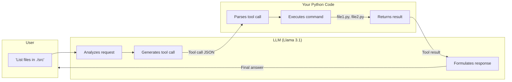
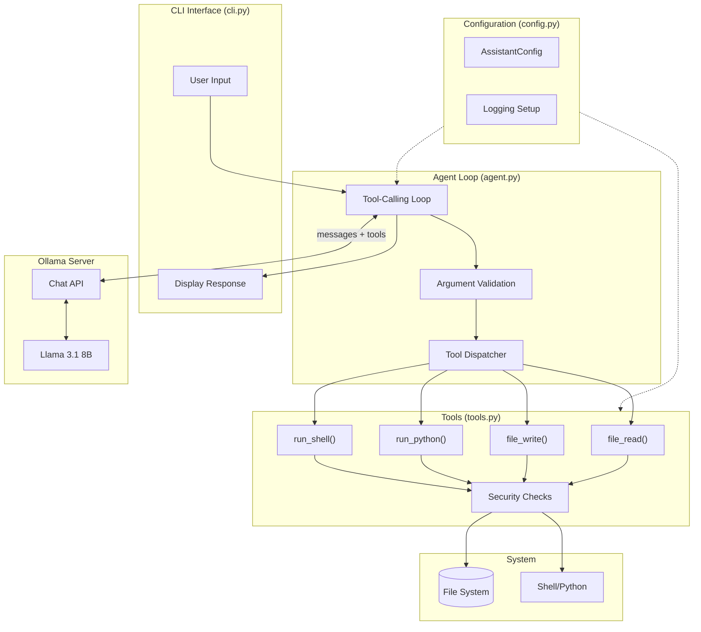
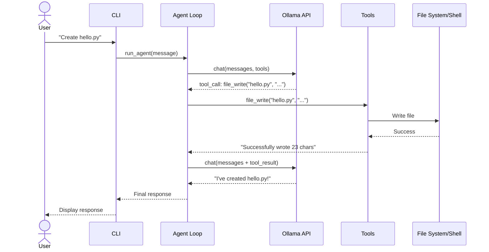

# Building a Local Coding Assistant with Tool Calling

A tutorial on building a Claude-like coding assistant that runs entirely on your local machine using Ollama. The assistant can read files, write code, and execute commands.

> **Tested with:** Ollama v0.5.x, Llama 3.1 8B, Python 3.11+, macOS Sonoma 14.x on M1 MacBook Pro

---

## Table of Contents

**Part 1: Understanding Tool Calling**
- [Quick Start](#quick-start)
- [How Tool Calling Works](#how-tool-calling-works)
- [Prerequisites](#prerequisites)
- [Model Selection](#model-selection)

**Part 2: Building the Assistant**
- [Architecture Overview](#architecture-overview)
- [Configuration Module](#configuration-module)
- [Implementing Tools](#implementing-tools)
- [The Agent Loop](#the-agent-loop)
- [Building the CLI](#building-the-cli)
- [Package Initialization](#package-initialization)
- [Complete Example](#complete-example)
- [Safety Considerations](#safety-considerations)
- [Troubleshooting](#troubleshooting)
- [Glossary](#glossary)

---

## Part 1: Understanding Tool Calling

### Quick Start

For experienced users who want to get running immediately:

```bash
# Ensure Ollama is running with a tool-capable model
ollama pull llama3.1:8b

# Install the Python Ollama library
pip install ollama

# Run the CLI (from within coding_assistant directory)
cd coding_assistant
python cli.py

# Or run as a Python package (from parent directory)
python -m coding_assistant.cli

# With options
python cli.py --workspace ~/myproject --model llama3.1:8b --debug
```

That's it! For detailed explanations, read on.

### How Tool Calling Works

**The key insight:** The LLM does not actually execute code. It generates structured requests (tool calls) that your code interprets and executes. The LLM then receives the results and decides what to do next.



This is fundamentally different from Claude Code or similar tools where the LLM has direct execution capabilities. Here, you're building the execution layer yourself.

| What the LLM does | What your code does |
|-------------------|---------------------|
| Understands the user request | Receives tool call JSON |
| Decides which tool to call | Validates and executes the tool |
| Provides arguments | Returns results to the LLM |
| Interprets results | Manages conversation state |
| Formulates final response | Displays output to user |

### Prerequisites

- **Ollama** installed and running ([see installation guide](ollama_llama31_m1.md))
- **Python 3.10+** with pip
- **16GB RAM** for Llama 3.1 8B (or 8GB for smaller models)
- Basic Python knowledge

### Model Selection

Not all models support tool calling. Here are recommended options:

| Model | Size | RAM Required | Tool Support | Notes |
|-------|------|--------------|--------------|-------|
| `llama3.1:8b` | 4.7GB | 16GB | Excellent | **Recommended** - Best balance |
| `llama3.2:3b` | 2GB | 8GB | Good | For lower-memory systems |
| `qwen2.5:7b` | 4.4GB | 16GB | Excellent | Strong alternative |
| `mistral:7b` | 4.1GB | 16GB | Good | European compliance |

Verify your model supports tools:

```bash
# Pull the recommended model
ollama pull llama3.1:8b

# Check model details
ollama show llama3.1:8b
```

---

## Part 2: Building the Assistant

### Architecture Overview

The coding assistant has four main components:



**File structure:**
```
coding_assistant/
├── __init__.py   # Package exports
├── config.py     # Centralized configuration
├── tools.py      # Tool definitions with security
├── agent.py      # Agent loop with validation
└── cli.py        # Interactive CLI
```

### Configuration Module

The configuration module centralizes all settings using a dataclass, replacing scattered global variables with a clean, testable interface.

#### config.py

```python
"""
Configuration management for the coding assistant.

Provides a centralized configuration class that replaces mutable globals,
enabling thread-safety and easier testing.
"""

from __future__ import annotations

import logging
import sys
from dataclasses import dataclass, field
from pathlib import Path
from typing import Optional

# Default values
DEFAULT_MODEL = "llama3.1:8b"
DEFAULT_MAX_ITERATIONS = 10
DEFAULT_COMMAND_TIMEOUT = 30
DEFAULT_MAX_HISTORY_MESSAGES = 50
DEFAULT_MAX_TOOL_RESULT_SIZE = 10_000


@dataclass
class AssistantConfig:
    """Configuration for the coding assistant."""

    workspace_dir: Path = field(default_factory=Path.cwd)
    model: str = DEFAULT_MODEL
    max_iterations: int = DEFAULT_MAX_ITERATIONS
    command_timeout: int = DEFAULT_COMMAND_TIMEOUT
    max_history_messages: int = DEFAULT_MAX_HISTORY_MESSAGES
    max_tool_result_size: int = DEFAULT_MAX_TOOL_RESULT_SIZE
    log_level: int = logging.INFO
    log_file: Optional[str] = None

    def __post_init__(self) -> None:
        """Ensure workspace_dir is resolved to absolute path."""
        self.workspace_dir = Path(self.workspace_dir).resolve()


# Global configuration instance
_config: Optional[AssistantConfig] = None


def get_config() -> AssistantConfig:
    """
    Get the current configuration.

    Returns:
        The current AssistantConfig instance, creating a default one if needed.
    """
    global _config
    if _config is None:
        _config = AssistantConfig()
    return _config


def set_config(config: AssistantConfig) -> None:
    """
    Set the configuration.

    Useful for testing or programmatic configuration.

    Args:
        config: The new configuration to use.
    """
    global _config
    _config = config


def reset_config() -> None:
    """Reset configuration to default (useful for testing)."""
    global _config
    _config = None


def setup_logging(
    level: int = logging.INFO,
    log_file: Optional[str] = None,
) -> logging.Logger:
    """
    Configure logging for the coding assistant.

    Args:
        level: Logging level (default: INFO)
        log_file: Optional file path for logging

    Returns:
        Configured logger instance
    """
    logger = logging.getLogger("coding_assistant")
    logger.setLevel(level)

    # Remove existing handlers to avoid duplicates
    logger.handlers.clear()

    # Console handler
    console_handler = logging.StreamHandler(sys.stderr)
    console_handler.setLevel(level)
    console_format = logging.Formatter(
        "%(asctime)s - %(name)s - %(levelname)s - %(message)s",
        datefmt="%H:%M:%S",
    )
    console_handler.setFormatter(console_format)
    logger.addHandler(console_handler)

    # File handler (if specified)
    if log_file:
        file_handler = logging.FileHandler(log_file)
        file_handler.setLevel(logging.DEBUG)
        file_format = logging.Formatter(
            "%(asctime)s - %(name)s - %(levelname)s - "
            "%(filename)s:%(lineno)d - %(message)s"
        )
        file_handler.setFormatter(file_format)
        logger.addHandler(file_handler)

    return logger
```

**Key points:**
- `AssistantConfig` dataclass holds all configuration values with sensible defaults
- `get_config()` returns the global config, creating a default if needed
- `set_config()` allows programmatic configuration (useful for testing)
- `setup_logging()` configures structured logging with optional file output
- Using a dataclass makes configuration explicit and IDE-friendly

### Implementing Tools

Each tool is a Python function that the LLM can request to be called. The Ollama library automatically generates JSON schemas from the function signatures and docstrings.

#### tools.py

```python
"""
Tool definitions for the local coding assistant.

This module provides tools that the LLM can request to be executed:
- file_read: Read file contents
- file_write: Write content to files
- run_python: Execute Python code
- run_shell: Execute shell commands

All tools include safety measures like workspace restrictions and timeouts.
"""

from __future__ import annotations

import logging
import os
import signal
import subprocess
from pathlib import Path
from typing import TYPE_CHECKING

if TYPE_CHECKING:
    from .config import AssistantConfig

logger = logging.getLogger("coding_assistant.tools")

# Configuration constants
MAX_FILE_SIZE_BYTES = 1_000_000  # 1MB limit
MAX_OUTPUT_CHARS = 50_000  # Truncate output for LLM context
DEFAULT_TIMEOUT_SECONDS = 30

# Allowlist of safe shell commands
ALLOWED_SHELL_COMMANDS = frozenset({
    "ls", "pwd", "cat", "head", "tail", "wc", "grep", "find",
    "echo", "date", "whoami", "which", "file", "stat",
    "diff", "sort", "uniq", "tree", "du", "df", "mkdir", "touch",
    "cp", "mv", "rm",  # file operations within workspace
})

# Patterns that indicate dangerous shell operations
BLOCKED_SHELL_PATTERNS = frozenset({
    "|", "&&", "||", ";", "`", "$(",  # Command chaining/substitution
    ">", ">>", "<",  # Redirections
    "~",  # Home directory escape
})

# Dangerous Python imports/operations to block
DANGEROUS_PYTHON_PATTERNS = [
    "import os", "from os", "import subprocess", "from subprocess",
    "import socket", "from socket", "import urllib", "from urllib",
    "import requests", "from requests", "import http", "from http",
    "import ftplib", "from ftplib", "import telnetlib", "from telnetlib",
    "import smtplib", "from smtplib", "import ssl", "from ssl",
    "__import__", "eval(", "exec(", "compile(",
    "open(", "breakpoint(", "input(",
    "import sys", "from sys", "import shutil", "from shutil",
    "import glob", "from glob", "import pathlib", "from pathlib",
]

# Safety: Define allowed working directory
WORKSPACE_DIR = Path.cwd()


def _get_config() -> "AssistantConfig":
    """Get the current configuration."""
    try:
        from .config import get_config
        return get_config()
    except ImportError:
        from config import get_config
        return get_config()


def _is_path_within_workspace(path: Path, workspace: Path) -> bool:
    """
    Securely check if a path is within the workspace directory.

    Uses Path.is_relative_to() which properly handles edge cases
    including prefix attacks and normalizes paths correctly.
    """
    try:
        resolved_path = path.resolve()
        resolved_workspace = workspace.resolve()
        return resolved_path.is_relative_to(resolved_workspace)
    except (ValueError, RuntimeError):
        return False


def _resolve_and_validate_path(filepath: str) -> Path | str:
    """
    Resolve a filepath and validate it's within the workspace.

    Returns:
        Resolved Path if valid, or error message string if invalid
    """
    config = _get_config()
    workspace = config.workspace_dir

    path = Path(filepath)
    if not path.is_absolute():
        path = workspace / path

    path = path.resolve()

    # Secure path validation
    if not _is_path_within_workspace(path, workspace):
        logger.warning(f"Path access denied: {filepath} -> {path}")
        return f"Error: Access denied. Path must be within {workspace}"

    # Check for symlink escapes
    if path.exists() and path.is_symlink():
        real_path = path.resolve()
        if not _is_path_within_workspace(real_path, workspace):
            logger.warning(f"Symlink escape blocked: {filepath} -> {real_path}")
            return "Error: Symlink targets location outside workspace"

    return path


def _get_restricted_env() -> dict[str, str]:
    """Create a restricted environment for subprocess execution."""
    return {
        "PATH": "/usr/bin:/bin:/usr/local/bin",
        "HOME": str(_get_config().workspace_dir),
        "LANG": "C.UTF-8",
        "PYTHONDONTWRITEBYTECODE": "1",
        "PYTHONUNBUFFERED": "1",
    }


def _run_with_timeout(
    args: list[str],
    timeout: int,
    cwd: Path,
    shell: bool = False,
) -> tuple[str, str, int]:
    """
    Run a command with proper timeout handling that kills the entire process tree.
    """
    proc = None
    try:
        proc = subprocess.Popen(
            args,
            stdout=subprocess.PIPE,
            stderr=subprocess.PIPE,
            text=True,
            cwd=cwd,
            shell=shell,
            start_new_session=True,
            env=_get_restricted_env(),
        )
        stdout, stderr = proc.communicate(timeout=timeout)
        return stdout, stderr, proc.returncode

    except subprocess.TimeoutExpired:
        if proc:
            # Kill the entire process group
            try:
                os.killpg(os.getpgid(proc.pid), signal.SIGKILL)
            except (ProcessLookupError, PermissionError):
                proc.kill()
            proc.wait()
        raise
    except Exception:
        if proc:
            proc.kill()
            proc.wait()
        raise


def file_read(filepath: str, max_lines: int | None = None) -> str:
    """
    Read the contents of a file within the workspace.

    Args:
        filepath: Path to the file to read (relative to workspace or absolute)
        max_lines: Optional limit on number of lines to read

    Returns:
        The file contents as a string, or an error message prefixed
        with "Error:" if the operation failed.
    """
    logger.info(f"file_read: {filepath}")

    try:
        result = _resolve_and_validate_path(filepath)
        if isinstance(result, str):
            return result
        path = result

        if not path.exists():
            return f"Error: File not found: {filepath}"

        if not path.is_file():
            return f"Error: Not a file: {filepath}"

        # Check file size before reading
        file_size = path.stat().st_size
        if file_size > MAX_FILE_SIZE_BYTES:
            return (
                f"Error: File too large ({file_size:,} bytes). "
                f"Maximum allowed: {MAX_FILE_SIZE_BYTES:,} bytes."
            )

        content = path.read_text(encoding="utf-8")

        # Optionally limit lines
        if max_lines:
            lines = content.split('\n')
            if len(lines) > max_lines:
                content = '\n'.join(lines[:max_lines])
                content += f"\n\n... (truncated, showing {max_lines} of {len(lines)} lines)"

        # Truncate for LLM context if needed
        if len(content) > MAX_OUTPUT_CHARS:
            content = content[:MAX_OUTPUT_CHARS]
            content += f"\n\n... (truncated at {MAX_OUTPUT_CHARS:,} characters)"

        logger.info(f"file_read success: {filepath} ({len(content)} chars)")
        return content

    except PermissionError:
        return f"Error: Permission denied reading {filepath}"
    except Exception as e:
        logger.exception(f"Error reading file: {filepath}")
        return f"Error reading file: {str(e)}"


def file_write(filepath: str, content: str) -> str:
    """
    Write content to a file within the workspace, creating directories if needed.

    Args:
        filepath: Path to the file to write (relative to workspace or absolute)
        content: The content to write to the file

    Returns:
        Success message or error description
    """
    logger.info(f"file_write: {filepath} ({len(content)} chars)")

    try:
        result = _resolve_and_validate_path(filepath)
        if isinstance(result, str):
            return result
        path = result

        path.parent.mkdir(parents=True, exist_ok=True)
        path.write_text(content, encoding="utf-8")
        logger.info(f"file_write success: {filepath}")
        return f"Successfully wrote {len(content)} characters to {filepath}"

    except PermissionError:
        return f"Error: Permission denied writing to {filepath}"
    except Exception as e:
        logger.exception(f"Error writing file: {filepath}")
        return f"Error writing file: {str(e)}"


def run_python(code: str) -> str:
    """
    Execute Python code with safety restrictions and return the output.

    Args:
        code: Python code to execute

    Returns:
        The stdout/stderr output from running the code
    """
    logger.info(f"run_python: {code[:100]}...")

    # Check for dangerous patterns
    code_lower = code.lower()
    for pattern in DANGEROUS_PYTHON_PATTERNS:
        if pattern.lower() in code_lower:
            logger.warning(f"Blocked dangerous Python pattern: {pattern}")
            return f"Error: Potentially unsafe operation detected: '{pattern}'"

    config = _get_config()

    try:
        stdout, stderr, returncode = _run_with_timeout(
            ["python3", "-c", code],
            timeout=config.command_timeout,
            cwd=config.workspace_dir,
        )

        output = stdout
        if stderr:
            output += f"\nStderr: {stderr}"
        if returncode != 0:
            output += f"\nExit code: {returncode}"

        result = output if output.strip() else "(No output)"
        logger.info(f"run_python completed: exit={returncode}")
        return result

    except subprocess.TimeoutExpired:
        return f"Error: Code execution timed out ({config.command_timeout} second limit)"
    except FileNotFoundError:
        return "Error: Python interpreter not found"
    except Exception as e:
        logger.exception("Error executing Python")
        return f"Error executing Python: {str(e)}"


def run_shell(command: str) -> str:
    """
    Execute a restricted shell command and return the output.

    Only allows a predefined set of safe commands. Command chaining
    and redirections are blocked for security.

    Args:
        command: Shell command to execute

    Returns:
        The stdout/stderr output from the command
    """
    logger.info(f"run_shell: {command}")

    # Check for dangerous patterns
    for pattern in BLOCKED_SHELL_PATTERNS:
        if pattern in command:
            logger.warning(f"Blocked shell pattern: {pattern}")
            return f"Error: Command contains forbidden pattern '{pattern}'. Command chaining and redirections are not allowed."

    # Parse command to get base command
    import shlex
    try:
        parts = shlex.split(command)
    except ValueError as e:
        return f"Error: Invalid command syntax: {e}"

    if not parts:
        return "Error: Empty command"

    base_command = parts[0]

    # Check if command is in allowlist
    if base_command not in ALLOWED_SHELL_COMMANDS:
        return (
            f"Error: Command '{base_command}' is not allowed. "
            f"Allowed commands: {', '.join(sorted(ALLOWED_SHELL_COMMANDS))}"
        )

    # Additional path validation for file operation commands
    if base_command in {"rm", "mv", "cp"}:
        for arg in parts[1:]:
            if not arg.startswith("-"):
                result = _resolve_and_validate_path(arg)
                if isinstance(result, str):
                    return result

    config = _get_config()

    try:
        stdout, stderr, returncode = _run_with_timeout(
            parts,  # Use parsed parts, not shell=True
            timeout=config.command_timeout,
            cwd=config.workspace_dir,
            shell=False,  # Safer: no shell interpretation
        )

        output = stdout
        if stderr:
            output += f"\nStderr: {stderr}"
        if returncode != 0:
            output += f"\nExit code: {returncode}"

        result = output if output.strip() else "(No output)"
        logger.info(f"run_shell completed: exit={returncode}")
        return result

    except subprocess.TimeoutExpired:
        return f"Error: Command execution timed out ({config.command_timeout} second limit)"
    except Exception as e:
        logger.exception("Error executing shell command")
        return f"Error executing command: {str(e)}"


# Registry mapping tool names to functions
TOOLS: dict[str, callable] = {
    "file_read": file_read,
    "file_write": file_write,
    "run_python": run_python,
    "run_shell": run_shell,
}

# List of tool functions for Ollama's tools parameter
TOOL_FUNCTIONS = [file_read, file_write, run_python, run_shell]
```

**Key points:**
- Each function has typed parameters and a docstring - Ollama uses these to generate the tool schema
- **Shell command allowlist**: Only safe commands like `ls`, `cat`, `grep` are permitted
- **Blocked patterns**: Command chaining (`&&`, `|`, `;`) and redirections are blocked
- **Python safety**: Dangerous imports (`os`, `subprocess`, `socket`) are blocked
- **Symlink escape detection**: Prevents symlinks pointing outside workspace
- **Process group killing**: Timeouts kill the entire process tree, not just the parent
- **Restricted environment**: Subprocesses run with minimal PATH and environment
- Error messages are returned as strings, not raised as exceptions

### The Agent Loop

The agent loop is the core of the assistant. It sends messages to the LLM, detects tool calls, executes them, and feeds results back until the LLM provides a final response.



#### agent.py

```python
"""
Agent loop for the local coding assistant.

This module implements the core agent loop that:
1. Sends user messages to the LLM with available tools
2. Detects when the LLM wants to call a tool
3. Executes the tool and returns the result
4. Continues until the LLM provides a final response
"""

from __future__ import annotations

import logging
from typing import Any, Literal, TypedDict

import ollama

logger = logging.getLogger("coding_assistant.agent")


# Type definitions for message structure
class Message(TypedDict, total=False):
    """Type definition for conversation messages."""

    role: Literal["system", "user", "assistant", "tool"]
    content: str
    tool_calls: list[Any]


# Tool argument schemas for validation
TOOL_SCHEMAS: dict[str, dict[str, Any]] = {
    "file_read": {
        "required": ["filepath"],
        "types": {"filepath": str, "max_lines": int},
    },
    "file_write": {
        "required": ["filepath", "content"],
        "types": {"filepath": str, "content": str},
    },
    "run_python": {
        "required": ["code"],
        "types": {"code": str},
    },
    "run_shell": {
        "required": ["command"],
        "types": {"command": str},
    },
}

# System prompt that defines the assistant's behavior
SYSTEM_PROMPT = """You are a helpful coding assistant with access to the following tools:

1. file_read(filepath) - Read the contents of a file
2. file_write(filepath, content) - Write content to a file
3. run_python(code) - Execute Python code and return output
4. run_shell(command) - Execute a shell command and return output

When the user asks you to perform coding tasks:
- Use file_read to examine existing code before modifying it
- Use file_write to create or update files
- Use run_python to test code or perform calculations
- Use run_shell for system operations like listing files

Always explain what you're doing before using a tool. After receiving a tool result,
analyze it and decide if you need to take additional steps or can provide a final answer.

Be concise but thorough. If a task requires multiple steps, complete all of them."""


def _get_config():
    """Get the current configuration."""
    try:
        from .config import get_config
        return get_config()
    except ImportError:
        from config import get_config
        return get_config()


def _get_tools():
    """Get the tools registry."""
    try:
        from .tools import TOOLS, TOOL_FUNCTIONS
        return TOOLS, TOOL_FUNCTIONS
    except ImportError:
        from tools import TOOLS, TOOL_FUNCTIONS
        return TOOLS, TOOL_FUNCTIONS


def validate_tool_args(tool_name: str, args: dict[str, Any]) -> tuple[bool, str]:
    """
    Validate tool arguments match expected schema.

    Args:
        tool_name: Name of the tool being called
        args: Arguments provided by the LLM

    Returns:
        Tuple of (is_valid, error_message)
    """
    schema = TOOL_SCHEMAS.get(tool_name)
    if not schema:
        return False, f"Unknown tool: {tool_name}"

    # Check required arguments
    for required in schema["required"]:
        if required not in args:
            return False, f"Missing required argument: {required}"

    # Check types
    for arg_name, expected_type in schema["types"].items():
        if arg_name in args and not isinstance(args[arg_name], expected_type):
            actual_type = type(args[arg_name]).__name__
            return False, (
                f"Argument '{arg_name}' must be {expected_type.__name__}, "
                f"got {actual_type}"
            )

    return True, ""


def _truncate_tool_result(result: str, max_size: int) -> str:
    """Truncate tool result if too large, keeping beginning and end for context."""
    if len(result) <= max_size:
        return result

    half = max_size // 2 - 50
    return (
        result[:half]
        + f"\n\n... [{len(result) - max_size:,} characters truncated] ...\n\n"
        + result[-half:]
    )


def _trim_conversation_history(
    messages: list[Message],
    max_messages: int,
) -> list[Message]:
    """Trim conversation history while preserving system prompt."""
    if len(messages) <= max_messages:
        return messages

    system_messages = [m for m in messages if m.get("role") == "system"]
    other_messages = [m for m in messages if m.get("role") != "system"]

    keep_count = max_messages - len(system_messages)
    trimmed = system_messages + other_messages[-keep_count:]

    logger.info(
        f"Trimmed conversation history: {len(messages)} -> {len(trimmed)} messages"
    )
    return trimmed


def run_agent(
    user_message: str,
    messages: list[Message] | None = None,
) -> tuple[str, list[Message]]:
    """
    Run the agent loop for a user message.

    The agent will:
    1. Send the message to the LLM with available tools
    2. If the LLM returns tool calls, execute them and continue
    3. Repeat until the LLM returns a final text response

    Args:
        user_message: The user's input message
        messages: Optional existing conversation history

    Returns:
        A tuple of (final_response, updated_messages)
    """
    config = _get_config()
    TOOLS, TOOL_FUNCTIONS = _get_tools()

    logger.info(f"Agent run started: {user_message[:100]}...")

    # Initialize conversation with system prompt if needed
    if messages is None:
        messages = [{"role": "system", "content": SYSTEM_PROMPT}]

    messages.append({"role": "user", "content": user_message})

    # Trim history if needed
    messages = _trim_conversation_history(messages, config.max_history_messages)

    iteration = 0

    while iteration < config.max_iterations:
        iteration += 1
        logger.debug(f"Agent iteration {iteration}/{config.max_iterations}")

        # Call the LLM with tools
        response = ollama.chat(
            model=config.model,
            messages=messages,
            tools=TOOL_FUNCTIONS,
        )

        assistant_message = response.message
        messages.append(assistant_message)

        # No tool calls = final response
        if not assistant_message.tool_calls:
            logger.info("Agent run completed with final response")
            return assistant_message.content or "", messages

        # Process each tool call
        for tool_call in assistant_message.tool_calls:
            tool_name = tool_call.function.name
            tool_args = tool_call.function.arguments

            logger.info(f"Tool call: {tool_name}")

            # Display tool call info
            print(f"\n  [Tool: {tool_name}]")
            if tool_name == "run_python":
                code = tool_args.get("code", "")
                print(f"  Code: {code[:100]}..." if len(code) > 100 else f"  Code: {code}")
            elif tool_name == "run_shell":
                print(f"  Command: {tool_args.get('command', '')}")
            elif tool_name == "file_read":
                print(f"  File: {tool_args.get('filepath', '')}")
            elif tool_name == "file_write":
                filepath = tool_args.get("filepath", "")
                content = tool_args.get("content", "")
                print(f"  File: {filepath}")
                print(f"  Content: {len(content)} characters")

            # Validate tool arguments
            is_valid, error_msg = validate_tool_args(tool_name, tool_args)
            if not is_valid:
                result = f"Error: Invalid tool arguments - {error_msg}"
                logger.warning(f"Tool validation failed: {error_msg}")
            elif tool_name in TOOLS:
                result = TOOLS[tool_name](**tool_args)
            else:
                result = f"Error: Unknown tool '{tool_name}'"

            # Truncate result if too large
            result = _truncate_tool_result(result, config.max_tool_result_size)

            # Show result preview
            result_preview = result[:200] + "..." if len(result) > 200 else result
            print(f"  Result: {result_preview}")

            # Add tool result to messages
            messages.append({
                "role": "tool",
                "content": result,
            })

    # Reached max iterations
    logger.warning(f"Agent reached max iterations ({config.max_iterations})")
    return (
        "I've reached the maximum number of steps. Please try a simpler request.",
        messages,
    )
```

**How the loop works:**

1. User message is added to the conversation history
2. History is trimmed if it exceeds `max_history_messages`
3. Full history is sent to the LLM with available tools
4. If the LLM returns tool calls, arguments are validated, then executed
5. Tool results are truncated if too large, then added as `role: tool` messages
6. The loop continues until the LLM responds without tool calls

**Enhancements over a basic implementation:**
- **Argument validation**: `TOOL_SCHEMAS` ensures the LLM provides correct argument types
- **Result truncation**: Large outputs are trimmed to avoid context overflow
- **History trimming**: Old messages are pruned while keeping the system prompt
- **Detailed logging**: Debug output helps troubleshoot issues

### Building the CLI

The CLI provides an interactive interface for chatting with the assistant.

#### cli.py

```python
#!/usr/bin/env python3
"""
Interactive CLI for the local coding assistant.

Run this script to start an interactive session where you can
ask the coding assistant to read files, write code, and run commands.

Usage:
    python cli.py
    python cli.py --workspace /path/to/project
    python -m coding_assistant.cli

Commands:
    /help   - Show available commands
    /clear  - Clear conversation history
    /quit   - Exit the assistant
"""

from __future__ import annotations

import argparse
import logging
import sys
from pathlib import Path
from typing import TYPE_CHECKING

if TYPE_CHECKING:
    from .agent import Message


def _import_modules():
    """Import modules with fallback for direct vs package execution."""
    try:
        from . import config, agent
        from .config import AssistantConfig, get_config, set_config, setup_logging
        return config, agent, AssistantConfig, get_config, set_config, setup_logging
    except ImportError:
        import config
        import agent
        from config import AssistantConfig, get_config, set_config, setup_logging
        return config, agent, AssistantConfig, get_config, set_config, setup_logging


def check_ollama_connection(model: str) -> tuple[bool, str]:
    """
    Verify Ollama is running and the model is available.

    Args:
        model: The model name to check for

    Returns:
        Tuple of (success, message)
    """
    try:
        import ollama
        models_response = ollama.list()

        # Extract model names from response
        available_models = []
        if hasattr(models_response, 'models'):
            available_models = [m.model for m in models_response.models]
        elif isinstance(models_response, dict) and 'models' in models_response:
            available_models = [m.get('model', m.get('name', '')) for m in models_response['models']]

        # Check if requested model is available (partial match)
        model_base = model.split(':')[0]
        found = any(model_base in m for m in available_models)

        if not found:
            model_list = ', '.join(available_models[:5]) or 'none'
            return False, (
                f"Model '{model}' not found.\n"
                f"Available models: {model_list}\n"
                f"Run: ollama pull {model}"
            )

        return True, f"Connected to Ollama with model {model}"

    except ImportError:
        return False, "Ollama Python package not installed. Run: pip install ollama"
    except Exception as e:
        error_msg = str(e)
        if "connection" in error_msg.lower() or "refused" in error_msg.lower():
            return False, (
                f"Cannot connect to Ollama: {e}\n"
                "Make sure Ollama is running: ollama serve"
            )
        return False, f"Error checking Ollama: {e}"


def print_banner() -> None:
    """Display the welcome banner."""
    print()
    print("=" * 60)
    print("  Local Coding Assistant")
    print("  Powered by Ollama + Llama 3.1")
    print("=" * 60)
    print()
    print("I can help you with coding tasks. I have access to tools for:")
    print("  - Reading and writing files")
    print("  - Running Python code")
    print("  - Executing shell commands")
    print()
    print("Commands:")
    print("  /help   Show this help message")
    print("  /clear  Clear conversation history")
    print("  /quit   Exit the assistant")
    print()


def main() -> int:
    """
    Main entry point for the CLI.

    Returns:
        Exit code (0 for success, 1 for error)
    """
    parser = argparse.ArgumentParser(description="Local Coding Assistant CLI")
    parser.add_argument(
        "--workspace", "-w",
        help="Workspace directory (default: current directory)",
        default=None
    )
    parser.add_argument(
        "--model", "-m",
        help="Ollama model to use (default: llama3.1:8b)",
        default="llama3.1:8b"
    )
    parser.add_argument(
        "--debug",
        action="store_true",
        help="Enable debug logging"
    )
    parser.add_argument(
        "--log-file",
        help="Write logs to file"
    )
    args = parser.parse_args()

    # Import modules
    config_mod, agent_mod, AssistantConfig, get_config, set_config, setup_logging = _import_modules()

    # Setup logging
    log_level = logging.DEBUG if args.debug else logging.WARNING
    setup_logging(level=log_level, log_file=args.log_file)
    logger = logging.getLogger("coding_assistant.cli")

    # Create configuration
    workspace = Path(args.workspace).resolve() if args.workspace else Path.cwd()
    assistant_config = AssistantConfig(
        workspace_dir=workspace,
        model=args.model,
        log_level=log_level,
        log_file=args.log_file,
    )
    set_config(assistant_config)

    print(f"Workspace: {assistant_config.workspace_dir}")
    logger.info(f"Workspace set to: {assistant_config.workspace_dir}")

    # Verify Ollama connection before starting
    print("Checking Ollama connection...")
    success, message = check_ollama_connection(args.model)
    if not success:
        print(f"Error: {message}")
        return 1
    print(f"OK: {message}\n")
    logger.info(message)

    print_banner()

    # Conversation history
    messages: list[Message] | None = None

    while True:
        try:
            user_input = input("You: ").strip()
        except (KeyboardInterrupt, EOFError):
            print("\n\nGoodbye!")
            break

        if not user_input:
            continue

        # Handle commands
        cmd = user_input.lower()

        if cmd in ["/quit", "/exit", "/q"]:
            print("Goodbye!")
            break

        elif cmd == "/clear":
            messages = None
            print("Conversation cleared.\n")
            continue

        elif cmd in ["/help", "/?"]:
            print_banner()
            continue

        # Run the agent
        print()
        print("Assistant: ", end="", flush=True)

        try:
            response, messages = agent_mod.run_agent(user_input, messages)
            print(f"\n{response}")
        except Exception as e:
            logger.exception("Error running agent")
            print(f"\nError: {e}")
            print("Make sure Ollama is running and the model is available.")
            print(f"Try: ollama pull {assistant_config.model}")

        print()

    return 0


if __name__ == "__main__":
    sys.exit(main())
```

**Key enhancements:**
- **Ollama connection check**: Verifies Ollama is running and the model exists before starting
- **Logging support**: `--debug` flag enables verbose logging, `--log-file` writes to file
- **Return codes**: Returns 0 on success, 1 on error (useful for scripting)
- **Package-compatible imports**: Works both as `python cli.py` and `python -m coding_assistant.cli`

### Package Initialization

The `__init__.py` file makes the directory a proper Python package and exports the public API.

#### \_\_init\_\_.py

```python
"""
Local Coding Assistant with Tool Calling

A simple coding assistant that uses Ollama to run a local LLM
with the ability to read/write files and execute code.

Usage:
    python -m coding_assistant.cli
    # or
    cd coding_assistant && python cli.py
"""

from .config import AssistantConfig, get_config, set_config, setup_logging
from .tools import file_read, file_write, run_python, run_shell, TOOLS
from .agent import run_agent, Message

__all__ = [
    # Configuration
    "AssistantConfig",
    "get_config",
    "set_config",
    "setup_logging",
    # Tools
    "file_read",
    "file_write",
    "run_python",
    "run_shell",
    "TOOLS",
    # Agent
    "run_agent",
    "Message",
]
```

This allows programmatic usage:

```python
from coding_assistant import run_agent, AssistantConfig, set_config

# Configure the assistant
config = AssistantConfig(
    workspace_dir="/path/to/project",
    model="llama3.1:8b",
)
set_config(config)

# Run a query
response, messages = run_agent("List all Python files in this directory")
print(response)
```

### Complete Example

Here's a complete interaction session:

```
$ python cli.py --workspace ~/myproject

Workspace: /Users/you/myproject
Checking Ollama connection...
OK: Connected to Ollama with model llama3.1:8b

============================================================
  Local Coding Assistant
  Powered by Ollama + Llama 3.1
============================================================

I can help you with coding tasks. I have access to tools for:
  - Reading and writing files
  - Running Python code
  - Executing shell commands

Commands:
  /help   Show this help message
  /clear  Clear conversation history
  /quit   Exit the assistant

You: Create a Python function that calculates fibonacci numbers and save it to fib.py
  [Tool: file_write]
  File: fib.py
  Content: 189 characters
  Result: Successfully wrote 189 characters to fib.py

I've created fib.py with a fibonacci function. Would you like me to test it?

You: Yes, test it with the first 10 numbers

  [Tool: run_python]
  Code: from fib import fibonacci; print([fibonacci(i) for i in range(10)])
  Result: [0, 1, 1, 2, 3, 5, 8, 13, 21, 34]

The fibonacci function is working correctly! It returns [0, 1, 1, 2, 3, 5, 8, 13, 21, 34]
for the first 10 numbers.
```

### Safety Considerations

Running LLM-generated code is inherently risky. This implementation includes multiple layers of protection:

#### Built-in Security Features

| Feature | Description |
|---------|-------------|
| **Workspace restriction** | All file operations confined to workspace directory |
| **Symlink escape detection** | Blocks symlinks that point outside workspace |
| **Shell command allowlist** | Only `ls`, `cat`, `grep`, etc. are permitted |
| **Blocked patterns** | `&&`, `|`, `;`, redirections are blocked |
| **Python import blocking** | Dangerous modules (`os`, `subprocess`, `socket`) blocked |
| **Execution timeouts** | All commands timeout after configurable seconds |
| **Process group killing** | Timeouts kill entire process trees, not just parents |
| **Restricted environment** | Subprocesses run with minimal PATH and env vars |
| **File size limits** | Large files are rejected to prevent memory issues |
| **Output truncation** | Large results are truncated to avoid context overflow |

#### How Path Validation Works

The implementation uses `Path.is_relative_to()` instead of string prefix matching:

```python
def _is_path_within_workspace(path: Path, workspace: Path) -> bool:
    """Securely check if a path is within the workspace."""
    try:
        resolved_path = path.resolve()
        resolved_workspace = workspace.resolve()
        return resolved_path.is_relative_to(resolved_workspace)
    except (ValueError, RuntimeError):
        return False
```

This prevents path traversal attacks like `/workspace/../etc/passwd`.

#### Shell Command Allowlist

Only safe, read-mostly commands are permitted:

```python
ALLOWED_SHELL_COMMANDS = frozenset({
    "ls", "pwd", "cat", "head", "tail", "wc", "grep", "find",
    "echo", "date", "whoami", "which", "file", "stat",
    "diff", "sort", "uniq", "tree", "du", "df", "mkdir", "touch",
    "cp", "mv", "rm",  # file operations within workspace
})
```

Commands like `curl`, `wget`, `ssh`, `sudo` are blocked by default.

#### Adding Confirmation Prompts

For extra safety, you can add confirmation prompts in the agent loop:

```python
DANGEROUS_TOOLS = {'file_write', 'run_shell', 'run_python'}

def get_confirmation(tool_name: str, tool_args: dict) -> bool:
    """Ask user to confirm a potentially dangerous operation."""
    print(f"\n{'='*50}")
    print(f"CONFIRMATION REQUIRED: {tool_name}")
    print(f"Arguments: {tool_args}")
    print(f"{'='*50}")

    response = input("Allow this operation? [y/n]: ").strip().lower()
    return response in ['y', 'yes']
```

#### Additional Safety Options

For production use, consider:

| Safety Measure | Description |
|----------------|-------------|
| Docker isolation | Run tools inside a container |
| Read-only mode | Remove `file_write` from `TOOLS` registry |
| Custom allowlist | Modify `ALLOWED_SHELL_COMMANDS` |
| Rate limiting | Add delay or counter in agent loop |
| Audit logging | Enable `--log-file` for all operations |

### Troubleshooting

| Issue | Cause | Solution |
|-------|-------|----------|
| "Model not found" | Model not pulled | Run `ollama pull llama3.1:8b` |
| No tool calls | Model not understanding | Check system prompt; try clearer requests |
| Infinite loop | LLM keeps calling tools | Check max_iterations limit |
| "Connection refused" | Ollama not running | Start Ollama: `ollama serve` |
| Empty responses | Model confusion | Clear history with `/clear` |
| Path access denied | File outside workspace | Use `--workspace` to set correct directory |
| Timeout errors | Long-running code | Simplify the task or increase timeout |
| "Command not allowed" | Shell command blocked | Check `ALLOWED_SHELL_COMMANDS` |

### Extending the Assistant

Ideas for extending the assistant:

1. **Add more tools**: web search, database queries, API calls
2. **Streaming responses**: Display tokens as they're generated
3. **Better UI**: Use `rich` or `textual` for a nicer terminal interface
4. **Persistent history**: Save conversation to a file
5. **Multiple models**: Switch models based on task type

---

## Glossary

| Term | Definition |
|------|------------|
| **Tool Calling** | LLM capability to generate structured requests for external functions |
| **Agent Loop** | Iterative process: send message → detect tool calls → execute → feed results back |
| **Tool Schema** | JSON structure describing a tool's name, parameters, and types |
| **Agentic Workflow** | Pattern where an LLM autonomously decides which tools to use |
| **Workspace** | Directory where the assistant is allowed to read/write files |
| **System Prompt** | Initial instruction that defines the assistant's behavior and available tools |

---

## Additional Resources

- [Ollama Documentation](https://ollama.com) - Official docs
- [Ollama Python Library](https://github.com/ollama/ollama-python) - Python bindings
- [Llama 3.1 Technical Report](https://ai.meta.com/research/publications/the-llama-3-herd-of-models/) - Model details
- [Tool Use Best Practices](https://ollama.com/blog/tool-support) - Ollama's guide to tools
