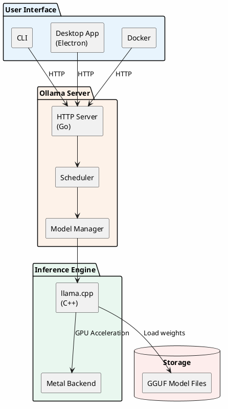
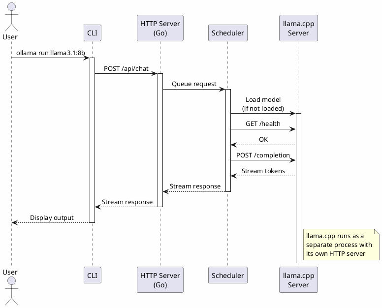
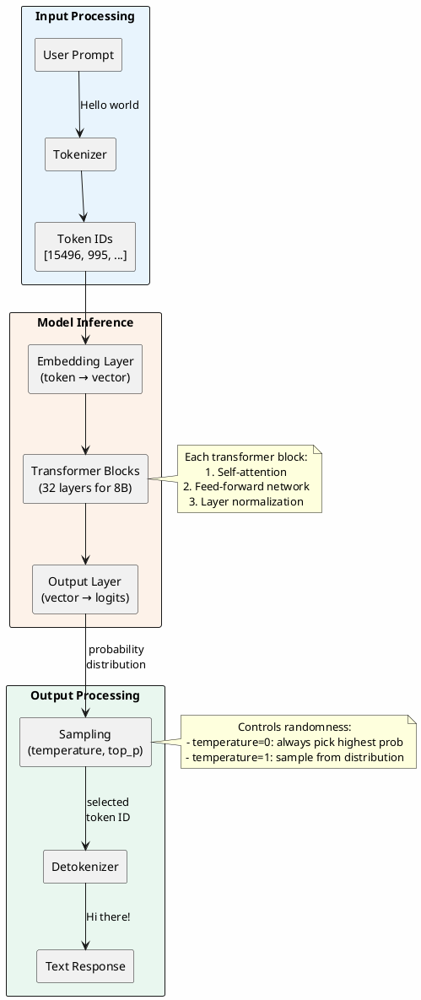
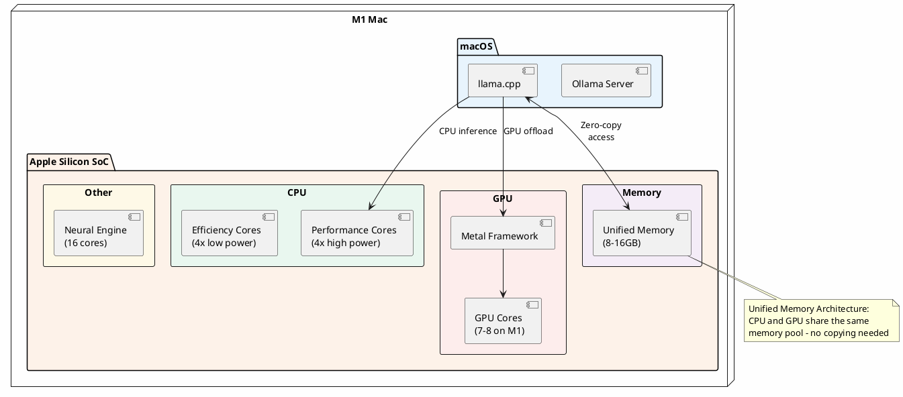
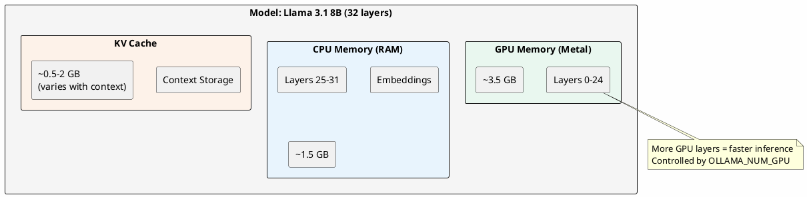
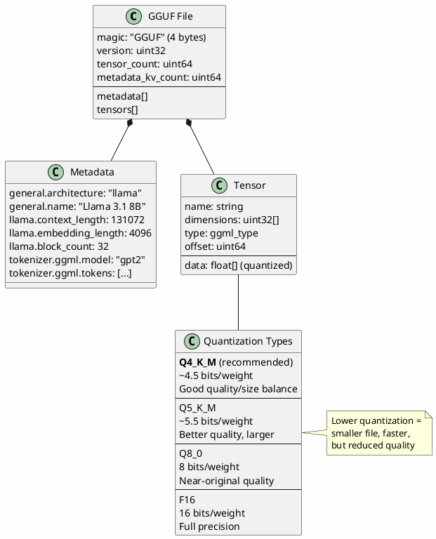
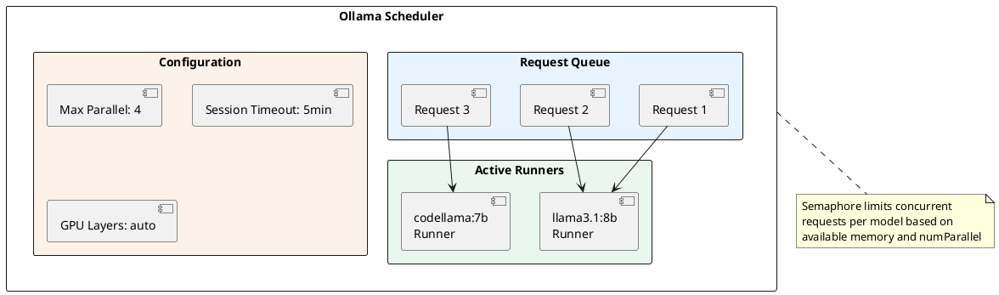

# Ollama with Llama 3.1 8B on M1 Mac

A two-part tutorial covering installation, setup, and architecture of running Llama 3.1 8B locally using Ollama on Apple Silicon.

> **Tested with:** Ollama v0.5.x, Llama 3.1 8B (Q4_K_M), macOS Sonoma 14.x on M1 MacBook Pro (16GB RAM)

---

## Table of Contents

**Part 1: Installation & Setup**
- [Quick Start](#quick-start)
- [Prerequisites](#prerequisites)
- [Installation](#installation)
- [Download Llama 3.1](#download-llama-31)
- [Common Commands](#common-commands)
- [API Usage](#api-usage)
- [Model Customization](#model-customization)
- [Performance Tips](#performance-tips)
- [Troubleshooting](#troubleshooting)
- [Uninstall](#uninstall)

**Part 2: Architecture**
- [System Architecture Overview](#system-architecture-overview)
- [Request Flow](#request-flow)
- [Data Flow & Inference Pipeline](#data-flow--inference-pipeline)
- [M1 Hardware Integration](#m1-hardware-integration)
- [Memory Management](#memory-management)
- [GGUF Model Format](#gguf-model-format)
- [Scheduler and Concurrency](#scheduler-and-concurrency)
- [Glossary](#glossary)

---

## Part 1: Installation & Setup

### Quick Start

For experienced users who want to get running immediately:

```bash
# Install via Homebrew
brew install ollama

# Pull Llama 3.1 8B model
ollama pull llama3.1:8b

# Start chatting
ollama run llama3.1:8b
```

That's it! For detailed explanations, read on.

### Prerequisites

- macOS 11 Big Sur or later
- Apple Silicon Mac (M1, M2, M3, or M4)
- **16GB RAM minimum** (8GB is insufficient for 8B model)
- ~8GB free disk space

### Installation

#### Method 1: Direct Download (Recommended)

1. Download from [ollama.com/download/mac](https://ollama.com/download/mac)
2. Extract the downloaded `.zip` file
3. Drag `Ollama.app` to your Applications folder
4. Launch Ollama and follow the setup wizard (this installs the CLI)

#### Method 2: Homebrew

```bash
brew install ollama
```

### Verify Installation

```bash
# Check version
ollama --version

# Verify native ARM64 binary (should show "arm64")
file $(which ollama)
```

### Download Llama 3.1

```bash
# Download the 8B model
ollama pull llama3.1:8b
```

**Model specifications:**
- Size: ~4.7GB (Q4_K_M quantization)
- Parameters: 8 billion
- Transformer layers: 32
- Hidden size: 4096
- Context length: 128K tokens
- Languages: English, German, French, Italian, Portuguese, Hindi, Spanish, Thai

For lighter workloads or machines with less RAM, consider the smaller 3.2 models:
```bash
ollama pull llama3.2:3b  # ~2GB, 3B parameters
ollama pull llama3.2:1b  # ~1GB, 1B parameters
```

### First Interaction

```bash
ollama run llama3.1:8b
```

Type your prompt and press Enter. Use `/bye` to exit the chat.

### Common Commands

```bash
# List downloaded models
ollama list

# Show model information
ollama show llama3.1:8b

# Remove a model
ollama rm llama3.1:8b

# Start server manually (runs automatically on macOS)
ollama serve

# Copy/customize a model
ollama cp llama3.1:8b my-custom-model
```

### API Usage

Ollama runs a local REST API server on port 11434.

#### curl Example

```bash
curl -X POST http://localhost:11434/api/generate \
  -H "Content-Type: application/json" \
  -d '{
    "model": "llama3.1:8b",
    "prompt": "Explain the concept of recursion in programming.",
    "stream": false
  }'
```

#### Streaming Response

```bash
curl -X POST http://localhost:11434/api/generate \
  -H "Content-Type: application/json" \
  -d '{
    "model": "llama3.1:8b",
    "prompt": "Write a haiku about coding."
  }'
```

#### Chat API (with conversation history)

```bash
curl -X POST http://localhost:11434/api/chat \
  -H "Content-Type: application/json" \
  -d '{
    "model": "llama3.1:8b",
    "messages": [
      {"role": "system", "content": "You are a helpful coding assistant."},
      {"role": "user", "content": "What is a closure in JavaScript?"}
    ]
  }'
```

#### Python with requests

```python
import requests

response = requests.post('http://localhost:11434/api/generate', json={
    'model': 'llama3.1:8b',
    'prompt': 'Explain quantum computing in one paragraph',
    'stream': False
})
print(response.json()['response'])
```

#### Python with ollama library

```bash
pip install ollama
```

```python
import ollama

# Simple generation
response = ollama.generate(model='llama3.1:8b', prompt='Hello!')
print(response['response'])

# Chat conversation
response = ollama.chat(model='llama3.1:8b', messages=[
    {'role': 'user', 'content': 'What is the capital of France?'}
])
print(response['message']['content'])

# Streaming
for chunk in ollama.chat(model='llama3.1:8b',
                         messages=[{'role': 'user', 'content': 'Tell me a story'}],
                         stream=True):
    print(chunk['message']['content'], end='', flush=True)
```

### Model Customization

Create custom models using a `Modelfile`. This allows you to set system prompts, adjust parameters, and create specialized assistants.

**Example: Create a coding assistant**

```bash
# Create a Modelfile
cat << 'EOF' > Modelfile
FROM llama3.1:8b

# Set the system prompt
SYSTEM """You are an expert software engineer. You write clean, efficient,
and well-documented code. When asked about code, you explain your reasoning
and suggest best practices."""

# Adjust generation parameters
PARAMETER temperature 0.7
PARAMETER top_p 0.9
PARAMETER num_ctx 4096
EOF

# Create the custom model
ollama create coding-assistant -f Modelfile

# Run your custom model
ollama run coding-assistant
```

**Common Modelfile parameters:**

| Parameter | Description | Default |
|-----------|-------------|---------|
| `temperature` | Creativity (0.0 = deterministic, 1.0 = creative) | 0.8 |
| `top_p` | Nucleus sampling threshold | 0.9 |
| `top_k` | Limit token choices per step | 40 |
| `num_ctx` | Context window size | 2048 |
| `repeat_penalty` | Penalize repetition | 1.1 |

### Performance Tips

- Close other memory-intensive applications for better performance
- Expected speed on M1: 15-25 tokens/second for 8B model
- Use `llama3.2:3b` or `llama3.2:1b` for faster inference with reduced capability
- Monitor temperature: M1 chips throttle at 100C, aim to stay below 85C
- Reduce `num_ctx` if running low on memory (8B model needs ~6GB+ for inference)

### Troubleshooting

#### "command not found: ollama"

The CLI wasn't added to your PATH. Either:
- Restart your terminal after installation
- Run the app from Applications to complete CLI setup
- Add manually: `export PATH="$PATH:/usr/local/bin"`

#### Port 11434 already in use

```bash
# Check what's using the port
lsof -i :11434

# Kill existing Ollama process
pkill ollama

# Restart
ollama serve
```

#### Model download fails or is slow

```bash
# Check available disk space (8B model needs ~5GB)
df -h

# Resume a failed download (Ollama auto-resumes)
ollama pull llama3.1:8b

# Try a different mirror (if available)
OLLAMA_HOST=https://mirror.example.com ollama pull llama3.1:8b
```

#### Out of memory errors

```bash
# Use a smaller model
ollama run llama3.1:8b  # 3B model, ~2GB
ollama run llama3.2:1b  # 1B model, ~1GB

# Or reduce context size for 8B model
ollama run llama3.1:8b --num-ctx 2048

# Check current memory usage
ollama ps
```

#### Model runs slowly

1. Ensure you're using native ARM64 binary: `file $(which ollama)`
2. Check if GPU acceleration is working: `ollama run llama3.1:8b --verbose`
3. Close other GPU-intensive applications
4. Check Activity Monitor for CPU/memory pressure
5. Ensure you have at least 16GB RAM (8B model is memory-intensive)

### Uninstall

To completely remove Ollama from your system:

```bash
# Stop the service
pkill ollama

# Remove the application
rm -rf /Applications/Ollama.app

# Remove CLI binary
sudo rm /usr/local/bin/ollama

# Remove models and configuration
rm -rf ~/.ollama

# Remove Homebrew package (if installed via brew)
brew uninstall ollama
```

---

## Part 2: Architecture

This section explains how Ollama works internally and how it leverages M1 hardware.

### System Architecture Overview

Ollama uses a client-server architecture where the server manages model loading, inference, and concurrent requests.



**Components explained:**

- **CLI/Desktop/Docker**: Entry points for user interaction. All communicate with the server via HTTP.
- **HTTP Server**: Go-based server handling REST API requests on port 11434.
- **Scheduler**: Manages concurrent requests, model loading/unloading, and resource allocation.
- **Model Manager**: Handles model downloads, storage, and lifecycle.
- **llama.cpp**: C++ inference engine that actually runs the model. Ollama uses CGO to bridge Go and C++.
- **Metal Backend**: Apple's GPU framework for hardware acceleration on M1.

### Request Flow

When you run `ollama run llama3.1:8b`, here's what happens:



**Key points:**

1. The CLI sends requests to the Ollama HTTP server
2. The scheduler checks if the model is already loaded
3. If not loaded, llama.cpp loads the model into memory
4. A health check ensures the inference server is ready
5. The completion request is processed and tokens stream back
6. Models stay loaded for 5 minutes (default) before unloading

### The CGO Bridge

Ollama is written in Go, but uses llama.cpp (C++) for actual inference. CGO (C bindings for Go) bridges these two worlds:

```
┌─────────────────────────────────────────────────────────────┐
│                     Ollama (Go)                             │
│  ┌─────────────┐  ┌─────────────┐  ┌─────────────────────┐  │
│  │ HTTP Server │  │  Scheduler  │  │   Model Manager     │  │
│  └─────────────┘  └─────────────┘  └─────────────────────┘  │
│                           │                                  │
│                           ▼                                  │
│               ┌───────────────────────┐                      │
│               │    CGO Interface      │                      │
│               │  (C function calls)   │                      │
│               └───────────────────────┘                      │
└─────────────────────────│────────────────────────────────────┘
                          │
┌─────────────────────────│────────────────────────────────────┐
│                         ▼                                    │
│               ┌───────────────────────┐                      │
│               │ ollama_llama_server   │                      │
│               │  (Modified llama.cpp) │                      │
│               └───────────────────────┘                      │
│                     llama.cpp (C++)                          │
└──────────────────────────────────────────────────────────────┘
```

This design allows Ollama to:
- Provide a user-friendly Go API and HTTP server
- Leverage llama.cpp's optimized C++ inference engine
- Use hardware-specific backends (Metal, CUDA) via compiled libraries

### Data Flow & Inference Pipeline

Understanding how your prompt becomes a response:



**Step-by-step breakdown:**

| Step | Component | What happens | Example |
|------|-----------|--------------|---------|
| 1 | Tokenizer | Text split into tokens | "Hello" → [15496] |
| 2 | Embedding | Tokens become vectors | [15496] → [0.1, -0.3, ...] (4096 dims) |
| 3 | Transformer | Context processed through layers | Attention + FFN × 32 |
| 4 | Output | Final vector to vocabulary logits | [...] → probability per token |
| 5 | Sampling | Select next token | P("Hi")=0.3, P("Hello")=0.2... → "Hi" |
| 6 | Detokenize | Token ID back to text | [17250] → "Hi" |

This process repeats for each output token (autoregressive generation).

### M1 Hardware Integration

Apple Silicon provides unique advantages for local LLM inference:



**M1 advantages for LLMs:**

| Feature | Benefit |
|---------|---------|
| Unified Memory | CPU and GPU share memory; no slow PCIe transfers |
| Metal GPU | Hardware acceleration via llama.cpp Metal backend |
| Efficiency Cores | Background tasks don't interrupt inference |
| Memory Bandwidth | 68GB/s (M1) enables fast token generation |
| Power Efficiency | Run models without excessive heat or battery drain |

**Performance expectations:**

| Model | M1 (8GB) | M1 Pro (16GB) | M1 Max (32GB) |
|-------|----------|---------------|---------------|
| Llama 3.2 1B | 40-50 tok/s | 50-60 tok/s | 55-65 tok/s |
| Llama 3.2 3B | 20-30 tok/s | 30-40 tok/s | 35-45 tok/s |
| **Llama 3.1 8B** | N/A (needs 16GB) | **15-25 tok/s** | **25-35 tok/s** |

> **Note:** The 8B model requires at least 16GB of unified memory. On 8GB M1 Macs, use the smaller 3.2 models instead.

### Memory Management

Understanding how Ollama distributes model layers between CPU and GPU memory:



**Memory allocation strategy:**

| Component | Location | Size (8B Q4) | Notes |
|-----------|----------|--------------|-------|
| Model weights | GPU + CPU | ~4.7 GB | Split based on available VRAM |
| KV Cache | RAM | 0.5-4 GB | Grows with context length |
| Activations | GPU | ~0.2 GB | Temporary computation buffers |
| Overhead | RAM | ~0.3 GB | Ollama server, tokenizer |

**Control GPU layer allocation:**

```bash
# Use all GPU layers (default - auto-detected)
ollama run llama3.1:8b

# Force specific number of GPU layers
OLLAMA_NUM_GPU=24 ollama run llama3.1:8b

# CPU-only mode (no GPU acceleration)
OLLAMA_NUM_GPU=0 ollama run llama3.1:8b
```

**Estimating memory needs:**

```
Total RAM ≈ Model Size + (Context Length × 2 × Layers × Hidden Size × 2 bytes)

For Llama 3.1 8B with 4K context:
≈ 4.7GB + (4096 × 2 × 32 × 4096 × 2 / 1e9) ≈ 4.7GB + 2.1GB ≈ 6.8GB

For Llama 3.1 8B with 32K context:
≈ 4.7GB + (32768 × 2 × 32 × 4096 × 2 / 1e9) ≈ 4.7GB + 17GB ≈ 21.7GB
```

> **Tip:** For long context usage (>8K tokens), you'll need 32GB+ RAM or should reduce `num_ctx`.

### GGUF Model Format

Ollama uses GGUF (GPT-Generated Unified Format), optimized for local inference:



**Why GGUF matters:**

- **Memory-mapped loading**: Models load almost instantly; OS handles paging
- **Quantization**: 4-bit models are ~4x smaller than full precision
- **Portable**: Same format works across CPU, CUDA, Metal
- **Metadata-rich**: Contains everything needed to run the model

### Scheduler and Concurrency

Ollama can handle multiple requests and models efficiently:



**Scheduling behavior:**

- **Model persistence**: Loaded models stay in memory for 5 minutes (configurable via `OLLAMA_KEEP_ALIVE`)
- **Concurrent requests**: Multiple requests to the same model are batched
- **Multi-model**: Can load multiple models if memory permits
- **Auto-unload**: Least recently used models are evicted when memory is needed

### Environment Variables

Customize Ollama behavior:

```bash
# Keep models loaded longer (default: 5m)
export OLLAMA_KEEP_ALIVE=30m

# Change server address
export OLLAMA_HOST=0.0.0.0:11434

# Set model storage location
export OLLAMA_MODELS=/path/to/models

# Limit GPU layers (for memory management)
export OLLAMA_NUM_GPU=20
```

---

## Glossary

| Term | Definition |
|------|------------|
| **CGO** | C bindings for Go; allows Go programs to call C/C++ code |
| **Context Length** | Maximum number of tokens the model can process at once (input + output) |
| **GGML** | Tensor library for machine learning; predecessor to GGUF |
| **GGUF** | GPT-Generated Unified Format; file format for storing quantized LLM weights |
| **Inference** | The process of generating output from a trained model |
| **KV Cache** | Key-Value cache; stores attention computations to speed up generation |
| **llama.cpp** | C++ library for efficient LLM inference on consumer hardware |
| **Metal** | Apple's GPU programming framework for hardware acceleration |
| **Quantization** | Reducing model precision (e.g., 32-bit → 4-bit) to decrease size and increase speed |
| **Q4_K_M** | A quantization method using ~4.5 bits per weight with mixed precision |
| **Sampling** | Process of selecting the next token from probability distribution |
| **Temperature** | Parameter controlling randomness in token selection (0=deterministic, 1=random) |
| **Token** | Basic unit of text processing; roughly 3/4 of a word on average |
| **Top-p (nucleus)** | Sampling method that considers tokens comprising top p% probability mass |
| **Transformer** | Neural network architecture using self-attention; basis for modern LLMs |
| **Unified Memory** | Apple Silicon architecture where CPU and GPU share the same memory pool |

---

## Additional Resources

- [Ollama Documentation](https://ollama.com) - Official docs and guides
- [Ollama GitHub](https://github.com/ollama/ollama) - Source code and issues
- [llama.cpp Project](https://github.com/ggerganov/llama.cpp) - The inference engine
- [Llama 3.1 on Ollama](https://ollama.com/library/llama3.1) - Model page and variants
- [Meta Llama](https://ai.meta.com/llama/) - Official Meta documentation
- [GGUF Specification](https://github.com/ggerganov/ggml/blob/master/docs/gguf.md) - File format details
